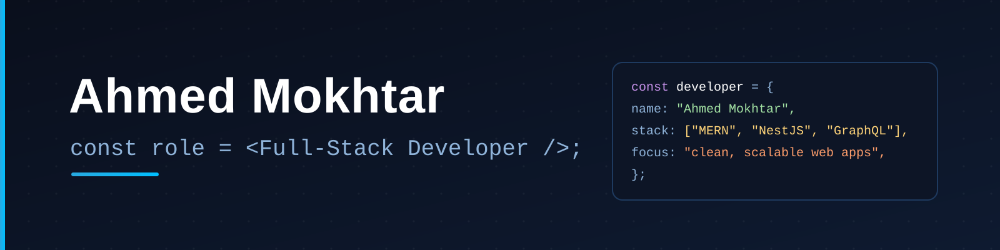

# Hi, I'm Ahmed Mokhtar

**@ahmed404mo · Cairo, Egypt**

I'm a **Junior Full-Stack Developer** with **1–2 years of experience**, building complete products end-to-end — e-commerce, realtime chat, social platforms and portfolios. I care about the whole journey: clean, scalable APIs and the frontends that consume them.

I work **TypeScript-first** across the MERN stack plus **NestJS** and **Prisma/PostgreSQL**, and I enjoy the details that make software reliable — caching, auth, realtime and payments.

  <a href="https://portfolio-coral-theta-31.vercel.app/">Portfolio</a> ·
  <a href="https://www.linkedin.com/in/ahmed-pandaa-18939b427">LinkedIn</a> ·
  <a href="mailto:mo879938@gmail.com">Email</a> ·
  <a href="https://wa.me/201096790839">WhatsApp</a>

Certified **Full-Stack Developer** (Meta & IBM, via Coursera).

---

## Currently

- **Working on** — hardening and scaling my backend projects: auth flows, rate limiting and realtime features.
- **Learning** — advanced Node.js architecture, system design and deeper TypeScript patterns.

## Tech Stack

**Frontend** — React, Next.js, TypeScript, Tailwind CSS, shadcn/ui, Redux, Bootstrap, SCSS, Framer Motion
**Backend** — Node.js, Express, NestJS, GraphQL, Stripe, Nodemailer
**Databases** — MongoDB (Mongoose), PostgreSQL (Prisma), MySQL (Sequelize), Redis
**Auth & Security** — JWT, NextAuth, Google OAuth, bcrypt / argon2, Helmet, rate limiting
**Validation** — Zod, Joi, class-validator
**Realtime** — Socket.IO, Pusher
**Mobile** — Capacitor, Firebase (FCM)
**Testing** — Jest, Supertest
**Tools** — Git & GitHub, Vercel, Cloudinary, Docker, Postman, npm / pnpm / yarn

---

## Featured Projects

### E-Commerce API
NestJS-based e-commerce backend covering the full shopping flow — JWT & Google OAuth auth with email confirmation, cart, coupons, orders, Stripe checkout, a REST **and** GraphQL API, and Socket.IO realtime presence over Redis.
**Tech:** NestJS · MongoDB · GraphQL · Redis · Stripe · Socket.IO
_No live demo — run locally (setup in the repo README)._

[Repository](https://github.com/ahmed404mo/BackEnd-E-Commerce)

### Mentora — Company Platform
Real-time company collaboration platform — group chat with read receipts, reactions and pinned messages, work orders and a portfolio. Ships as a Next.js web app plus an Android app (Capacitor) with FCM push notifications.
**Tech:** Next.js · Prisma · PostgreSQL · Socket.IO · Pusher · Capacitor · Firebase

[Repository](https://github.com/ahmed404mo/chat-Company-Platform) · [Live](https://chat-five-rho-38.vercel.app)

### Portfolio — Frontend
Personal portfolio (public site + admin dashboard) that fetches all content live from its REST API — updating the site never requires a redeploy.
**Tech:** Next.js · TypeScript · Tailwind CSS · shadcn/ui · Framer Motion
[Repository](https://github.com/ahmed404mo/FrontEnd-Portfolio) · [Live](https://portfolio-coral-theta-31.vercel.app/)

### Portfolio — Backend API
REST API powering the portfolio — content management (profile, projects, skills, certificates), JWT admin auth, Cloudinary image uploads, and contact-message email alerts.
**Tech:** Node.js · Express · MongoDB · JWT · Cloudinary · Nodemailer
[Repository](https://github.com/ahmed404mo/backEnd-Portfolio) · [Live API](https://portfolioapi-flame.vercel.app)

### Saraha App — Backend API
Backend for an anonymous-messaging platform — full auth flow (signup, email confirmation, password recovery), user profiles and anonymous messages, with JWT authorization and Redis rate limiting.
**Tech:** Node.js · Express 5 · MongoDB · Redis · JWT · Nodemailer
_No live demo — run locally (setup in the repo README)._

[Repository](https://github.com/ahmed404mo/SARAHA-APP-BackEnd)

### Social Media App — Backend API
Social media & real-time chat backend exposing REST and GraphQL APIs — friendships, posts with nested comments, one-to-one and group chat over Socket.IO, with Redis-backed sessions and Cloudinary media.
**Tech:** Node.js · Express · TypeScript · MongoDB · GraphQL · Socket.IO · Redis
_No live demo — run locally (setup in the repo README)._

[Repository](https://github.com/ahmed404mo/Social-MediaApp-Backend)

---

## GitHub Stats

  

---

**Reach me at** [mo879938@gmail.com](mailto:mo879938@gmail.com) or [WhatsApp](https://wa.me/201096790839) — happy to talk about full-stack roles.
